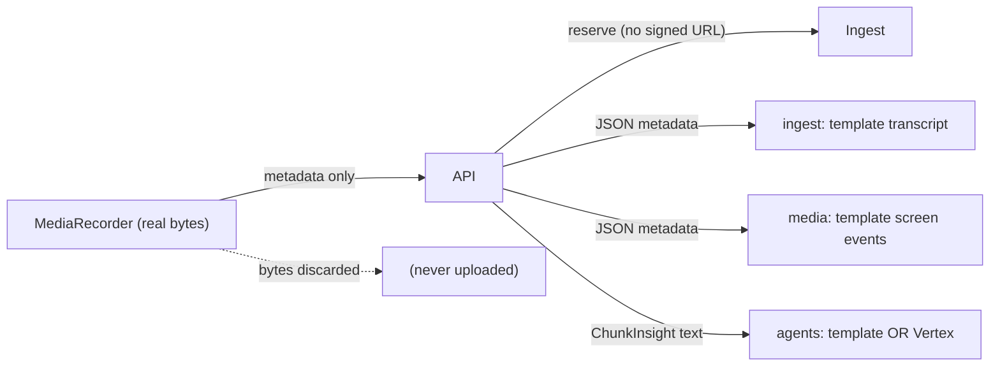
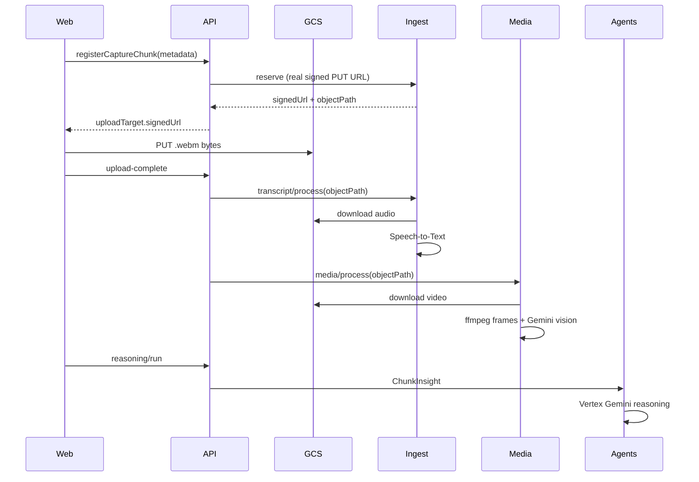

# Real Capture Pipeline for VisualSprint

> Plan to turn the metadata-only mock capture flow into a real end-to-end pipeline:
> upload actual recorded media to Google Cloud Storage, transcribe it with
> Speech-to-Text, analyze frames with Gemini vision, and run real Gemini agent
> reasoning — while keeping the deterministic templates as a fallback.

## Goal

Capture everything the user shares (screen video, system audio, microphone) and
process it for real: store media in GCS, transcribe with Google Speech-to-Text,
analyze frames with Gemini vision, and reason with the deployed Vertex agents.
GCP is ready and the target is the full real pipeline.

## Current state (verified)

The architecture already has clean seams, but every stage is metadata-only /
deterministic:

Key gaps:

- `apps/web/src/features/meeting-session/hooks/use-browser-capture.ts` reads
  `event.data.size` then calls upload-complete immediately — **bytes are never
  uploaded**.
- `services/ingest/src/visualsprint_ingest/uploads.py` builds an `objectPath` but
  never a real signed URL.
- `services/ingest/src/visualsprint_ingest/pipeline.py` and
  `services/media/src/visualsprint_media/pipeline.py` return canned templates;
  process requests carry no `storageObjectPath`.
- Agents already support real Vertex via `VISUALSPRINT_AGENT_MODE=configured_cloud`
  + `vertex_ai_reasoning_engine`, but default to mock.

## Target flow

## Phase 0 — Storage + config foundation

- Provision a GCS bucket (e.g. `visualsprint-capture-media`) with CORS allowing
  the web origin for `PUT`.
- Add settings to `services/ingest/src/visualsprint_ingest/config.py` and
  `services/media/src/visualsprint_media/config.py`: `GCS_BUCKET`,
  `GOOGLE_CLOUD_PROJECT`, `GOOGLE_CLOUD_LOCATION`, plus enable flags so each
  capability is opt-in and falls back to templates when unset.
- Add `google-cloud-storage`, `google-cloud-speech` to ingest deps;
  `google-cloud-storage`, `google-genai` (or `google-cloud-aiplatform`) + `ffmpeg`
  to media deps (`pyproject.toml` of each service).
- Add env to `.env.example`: bucket, signed-URL TTL, speech language, gemini
  vision model id.

## Phase 1 — Real media upload + capture breadth

- Extend contracts in `packages/contracts/src/domain.ts`: add `storageObjectPath`
  to chunk process inputs; add `displaySurface` (`"browser" | "window" |
  "monitor"`) to `StartCaptureSessionRequest`.
- `services/ingest/src/visualsprint_ingest/uploads.py`: generate a real GCS v4
  signed `PUT` URL; populate `signedUrl` + `expiresAt`.
- Frontend `apps/web/src/features/meeting-session/hooks/use-browser-capture.ts`:
  after `registerCaptureChunk`, `PUT` the real `event.data` Blob to
  `uploadTarget.signedUrl` with `requiredHeaders`, then call
  `completeCaptureChunkUpload` only on success.
- Capture breadth in `apps/web/src/lib/capture.ts`: read
  `videoTrack.getSettings().displaySurface`; pass it through; surface an
  audio-coverage warning when a window share has no audio track (the desktop-Zoom
  gotcha).
- API `services/api/src/visualsprint_api/repository.py` `_mark_chunk_uploaded`:
  optionally verify the GCS object exists before marking uploaded.

## Phase 2 — Real transcription (Speech-to-Text)

- Pass `storageObjectPath` through the process payload in
  `services/api/src/visualsprint_api/service_clients.py`
  (`process_transcript_chunk_with_source`).
- Add `storageObjectPath` to `ChunkTranscriptRequest` in
  `services/ingest/src/visualsprint_ingest/models.py`.
- Replace `build_transcript_segments` in
  `services/ingest/src/visualsprint_ingest/pipeline.py`: download the `.webm` from
  GCS, extract/convert audio, call Google Speech-to-Text (with diarization), map
  results to real `TranscriptSegment[]`. Keep templates as fallback when
  bucket/object missing.

## Phase 3 — Real vision (frames + Gemini)

- Pass `storageObjectPath` to media in
  `services/api/src/visualsprint_api/service_clients.py`
  (`process_media_chunk_with_source`); add field to `ChunkMediaRequest` in
  `services/media/src/visualsprint_media/models.py`.
- Replace `build_screen_events` in
  `services/media/src/visualsprint_media/pipeline.py`: download video from GCS,
  sample frames with ffmpeg, send frames to Gemini multimodal to classify
  `ScreenEventKind` and write `summary`. Optionally store frame thumbnails back to
  GCS. Template fallback retained.

## Phase 4 — Real agent reasoning

- The seam exists; this is mostly deploy + config. Deploy the ADK agents
  (`services/agents/adk_apps/*`) to Vertex Agent Engine, then set on the agents
  service: `VISUALSPRINT_AGENT_MODE=configured_cloud`,
  `VISUALSPRINT_AGENT_RUNTIME_BACKEND=vertex_ai_reasoning_engine`,
  project/location, and the three `*_ENGINE_RESOURCE_NAME` values.
- Point API at agents via `VISUALSPRINT_AGENTS_SERVICE_URL`.
- Fix the action-audit agent-id copy-paste bug in
  `services/agents/src/visualsprint_agents/action.py` (uses reasoning resource
  name for action).
- Optional: enrich `ChunkInsightRequest` in
  `services/agents/src/visualsprint_agents/models.py` so full transcript/screen
  arrays reach the agent rather than only distilled focus-area text.

## Phase 5 — Deploy + verify

- Add Dockerfiles + Cloud Run manifests for ingest and media (currently none)
  mirroring `services/api/Dockerfile`; wire `VISUALSPRINT_INGEST_SERVICE_URL` /
  `VISUALSPRINT_MEDIA_SERVICE_URL` on the API.
- Grant each service's service account GCS + Speech + Vertex IAM.
- Verify end-to-end: real meeting -> shared tab -> spoken audio transcribed ->
  on-screen content described -> real decisions/blockers in the report. Confirm
  template fallback still works when a capability is disabled.
- Run `npm run verify` (typecheck web + contracts + service compile + tests).

## Notes / decisions

- Every real capability is **opt-in via env** and falls back to the existing
  deterministic templates, so local dev without GCP keeps working.
- `MediaRecorder` produces incremental `.webm` chunks; for reliable per-chunk
  audio decoding, Phase 2 should convert/normalize audio server-side (ffmpeg in
  ingest) since standalone 4s webm fragments can lack headers. This is the main
  technical risk and may require recording with a small overlap or assembling
  audio per session.

## Task checklist

- [ ] **Phase 0** — Provision GCS bucket + CORS; add storage/speech/vision
  settings and deps to ingest and media config + pyproject; update `.env.example`.
- [ ] **Phase 1 (upload)** — Real signed PUT URL in `uploads.py`; frontend PUTs
  MediaRecorder Blob to GCS before upload-complete; add `displaySurface` +
  audio-coverage warning in `capture.ts`; add `storageObjectPath`/`displaySurface`
  to contracts.
- [ ] **Phase 1 (verify)** — API verifies GCS object exists in
  `_mark_chunk_uploaded` before processing.
- [ ] **Phase 2** — Pass `storageObjectPath` to ingest; replace transcript
  template with GCS download + Google Speech-to-Text (diarization), keep fallback.
- [ ] **Phase 3** — Pass `storageObjectPath` to media; replace screen-event
  template with ffmpeg frame extraction + Gemini vision classification, keep
  fallback.
- [ ] **Phase 4** — Deploy ADK agents to Vertex; set `configured_cloud` + vertex
  backend + engine resource names; point API at agents URL; fix action audit
  agent-id bug.
- [ ] **Phase 5** — Add Dockerfiles + Cloud Run manifests for ingest and media;
  wire service URLs + IAM; end-to-end verify and `npm run verify`.
